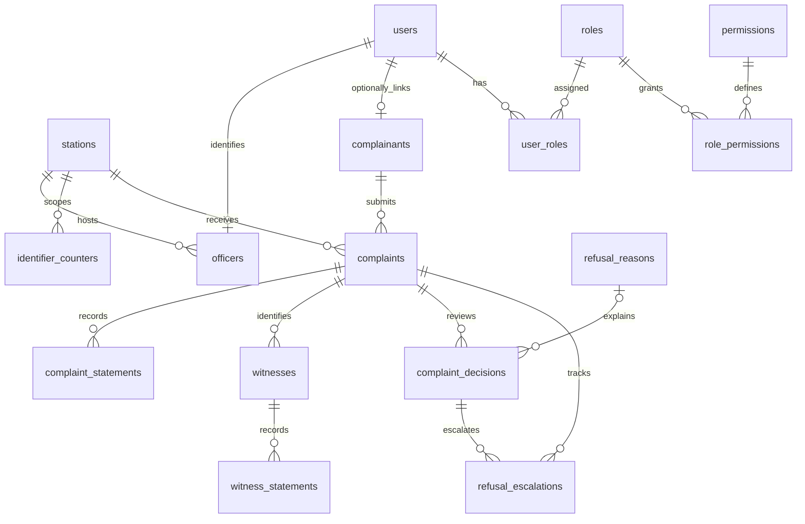
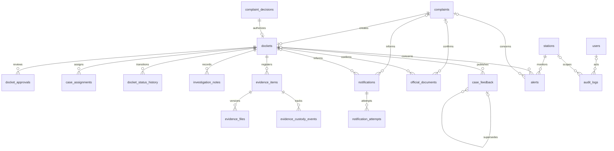

# SAPS Case-Docket database design

Authentication extension: revision `089c746ed6a9` adds `auth_sessions` and
`user_mfa_methods`, bringing the current total to 32 application tables. See
[Authentication](authentication.md) for their lifecycle, indexes, encrypted/hash
storage, transaction semantics, and API flow. The 30-table dictionary below records
the completed database-foundation phase before that extension.

## Purpose and sources of truth

This academic prototype supports complaint registration, refusal accountability, digital dockets, investigation, evidence custody, official communications, and access auditing. PostgreSQL is the operational source of truth: transactions coordinate related records, foreign keys preserve references, and constraints and triggers enforce structural integrity. Files remain in protected external storage; the database owns their metadata and integrity references.

Alembic revisions are the source of schema and seed history. SQLAlchemy models describe the current target schema but do not create production tables. Never use `Base.metadata.create_all()` or edit an applied migration. The migration chain is `9d6a130b9b0d` -> `53b49290f8f4` -> `fd1a582b8271` -> `a59515a63a4d` -> `1edbbd1f3330`.

The current schema has 30 application tables plus Alembic's `case_mgmt.alembic_version`. All application tables use `case_mgmt`; no application tables exist in `public`. Dashboards will query operational tables, not maintain duplicate dashboard tables.

## Conventions

UUID entity primary keys use the existing Python `uuid.uuid4` default; raw SQL writers must supply UUIDs. Join tables and identifier counters use composite primary keys. Timestamps are timezone-aware. `created_at`, `updated_at`, and event timestamps have database defaults where appropriate. `updated_at` advances through SQLAlchemy's `onupdate`; raw SQL/upsert services must explicitly advance it. Required business inputs intentionally have no server-generated defaults.

Naming uses `pk_`, `fk_`, `uq_`, `ix_`, and `ck_<table>_<rule>`. PostgreSQL/SQLAlchemy may truncate long names with a hash suffix. Controlled values use string CHECK constraints, never PostgreSQL enum types. Unique indexes enforce identifier uniqueness without a redundant unique constraint/index pair.

## Table groups and concise data dictionary

Field notation: `?` means nullable; all other fields are required. SQL types and primary/foreign/unique keys below are taken from the reviewed model metadata. Unless stated otherwise, foreign keys restrict deletion. This dictionary describes storage, not API payloads.

### Identity and access

**`users`**: Account identities and authentication metadata; passwords are hashes.

Fields: `username: VARCHAR(100)`, `email: VARCHAR(254)`, `password_hash: VARCHAR(255)`, `phone_number: VARCHAR(30)?`, `is_active: BOOLEAN`, `is_verified: BOOLEAN`, `mfa_enabled: BOOLEAN`, `failed_login_attempts: INTEGER`, `locked_until: TIMESTAMP WITH TIME ZONE?`, `last_login_at: TIMESTAMP WITH TIME ZONE?`, `id: UUID`, `created_at: TIMESTAMP WITH TIME ZONE`, `updated_at: TIMESTAMP WITH TIME ZONE`.

Keys: PK (id); UNIQUE INDEX (email); UNIQUE INDEX (username).

**`roles`**: Stable authorization role codes.

Fields: `code: VARCHAR(100)`, `name: VARCHAR(150)`, `description: TEXT?`, `is_system_role: BOOLEAN`, `id: UUID`, `created_at: TIMESTAMP WITH TIME ZONE`, `updated_at: TIMESTAMP WITH TIME ZONE`.

Keys: PK (id); UNIQUE (name); UNIQUE INDEX (code).

**`permissions`**: Stable capability codes.

Fields: `code: VARCHAR(100)`, `name: VARCHAR(150)`, `description: TEXT?`, `id: UUID`, `created_at: TIMESTAMP WITH TIME ZONE`, `updated_at: TIMESTAMP WITH TIME ZONE`.

Keys: PK (id); UNIQUE INDEX (code).

**`user_roles`**: User role assignments, actor, and assignment time.

Fields: `user_id: UUID`, `role_id: UUID`, `assigned_by_user_id: UUID?`, `assigned_at: TIMESTAMP WITH TIME ZONE`.

Keys: PK (user_id, role_id); FK (assigned_by_user_id) -> case_mgmt.users.id [SET NULL]; FK (role_id) -> case_mgmt.roles.id [CASCADE]; FK (user_id) -> case_mgmt.users.id [CASCADE].

**`role_permissions`**: Role capability grants and grant time.

Fields: `role_id: UUID`, `permission_id: UUID`, `granted_at: TIMESTAMP WITH TIME ZONE`.

Keys: PK (role_id, permission_id); FK (permission_id) -> case_mgmt.permissions.id [CASCADE]; FK (role_id) -> case_mgmt.roles.id [CASCADE].

### Police stations and officers

**`stations`**: Station identity, location, and contact metadata.

Fields: `station_code: VARCHAR(50)`, `name: VARCHAR(200)`, `province: VARCHAR(100)`, `district: VARCHAR(150)?`, `address_line_1: VARCHAR(255)?`, `address_line_2: VARCHAR(255)?`, `city: VARCHAR(150)?`, `postal_code: VARCHAR(20)?`, `phone_number: VARCHAR(30)?`, `is_active: BOOLEAN`, `id: UUID`, `created_at: TIMESTAMP WITH TIME ZONE`, `updated_at: TIMESTAMP WITH TIME ZONE`.

Keys: PK (id); UNIQUE INDEX (station_code).

**`officers`**: Officer identity linked to a user and station.

Fields: `user_id: UUID`, `station_id: UUID`, `service_number: VARCHAR(50)`, `rank: VARCHAR(100)`, `is_active: BOOLEAN`, `id: UUID`, `created_at: TIMESTAMP WITH TIME ZONE`, `updated_at: TIMESTAMP WITH TIME ZONE`.

Keys: PK (id); FK (station_id) -> case_mgmt.stations.id [RESTRICT]; FK (user_id) -> case_mgmt.users.id [RESTRICT]; UNIQUE (user_id); UNIQUE INDEX (service_number).

### Complainants

**`complainants`**: Complainant identity/contact and consent data, with optional user linkage.

Fields: `user_id: UUID?`, `first_name: VARCHAR(100)`, `last_name: VARCHAR(100)`, `email: VARCHAR(254)?`, `phone_number: VARCHAR(30)`, `preferred_contact_method: VARCHAR(10)`, `identity_type: VARCHAR(50)?`, `identity_number_encrypted: TEXT?`, `identity_number_hash: VARCHAR(128)?`, `address_line_1: VARCHAR(255)?`, `address_line_2: VARCHAR(255)?`, `city: VARCHAR(150)?`, `province: VARCHAR(100)?`, `postal_code: VARCHAR(20)?`, `privacy_notice_version: VARCHAR(50)?`, `consent_recorded_at: TIMESTAMP WITH TIME ZONE?`, `id: UUID`, `created_at: TIMESTAMP WITH TIME ZONE`, `updated_at: TIMESTAMP WITH TIME ZONE`.

Keys: PK (id); FK (user_id) -> case_mgmt.users.id [SET NULL]; UNIQUE (user_id); UNIQUE (identity_number_hash).

Checks: `preferred_contact_method IN ('SMS', 'EMAIL', 'PHONE')`.

### Complaints and statements

**`complaints`**: Complaint reference, intake channel, incident details, and current intake state.

Fields: `reference_number: VARCHAR(100)`, `complainant_id: UUID`, `station_id: UUID`, `registered_by_officer_id: UUID?`, `channel: VARCHAR(20)`, `status: VARCHAR(30)`, `crime_category: VARCHAR(150)`, `incident_description: TEXT`, `incident_occurred_at: TIMESTAMP WITH TIME ZONE?`, `incident_location: VARCHAR(255)`, `incident_city: VARCHAR(150)?`, `incident_province: VARCHAR(100)`, `submitted_at: TIMESTAMP WITH TIME ZONE`, `review_started_at: TIMESTAMP WITH TIME ZONE?`, `id: UUID`, `created_at: TIMESTAMP WITH TIME ZONE`, `updated_at: TIMESTAMP WITH TIME ZONE`.

Keys: PK (id); FK (complainant_id) -> case_mgmt.complainants.id [RESTRICT]; FK (registered_by_officer_id) -> case_mgmt.officers.id [RESTRICT]; FK (station_id) -> case_mgmt.stations.id [RESTRICT]; UNIQUE INDEX (reference_number).

Checks: `channel IN ('ONLINE', 'IN_STATION')`; `channel <> 'IN_STATION' OR registered_by_officer_id IS NOT NULL`; `status IN ('SUBMITTED', 'UNDER_REVIEW', 'ACCEPTED', 'REFUSED', 'ESCALATED', 'DOCKET_CREATED')`.

**`complaint_statements`**: Versioned complainant statement text, signing, and current-version flag.

Fields: `complaint_id: UUID`, `statement_text: TEXT`, `recorded_by_officer_id: UUID?`, `statement_version: INTEGER`, `is_current: BOOLEAN`, `signed_at: TIMESTAMP WITH TIME ZONE?`, `id: UUID`, `created_at: TIMESTAMP WITH TIME ZONE`, `updated_at: TIMESTAMP WITH TIME ZONE`.

Keys: PK (id); FK (complaint_id) -> case_mgmt.complaints.id [RESTRICT]; FK (recorded_by_officer_id) -> case_mgmt.officers.id [RESTRICT]; UNIQUE (complaint_id, statement_version); UNIQUE INDEX (complaint_id) WHERE is_current.

Checks: `statement_version > 0`.

**`witnesses`**: Witness details scoped to one complaint.

Fields: `complaint_id: UUID`, `first_name: VARCHAR(100)`, `last_name: VARCHAR(100)`, `phone_number: VARCHAR(30)?`, `email: VARCHAR(254)?`, `identity_number_encrypted: TEXT?`, `identity_number_hash: VARCHAR(128)?`, `address: TEXT?`, `id: UUID`, `created_at: TIMESTAMP WITH TIME ZONE`, `updated_at: TIMESTAMP WITH TIME ZONE`.

Keys: PK (id); FK (complaint_id) -> case_mgmt.complaints.id [RESTRICT].

**`witness_statements`**: Versioned witness statement text and signing metadata.

Fields: `witness_id: UUID`, `statement_text: TEXT`, `recorded_by_officer_id: UUID?`, `statement_version: INTEGER`, `is_current: BOOLEAN`, `signed_at: TIMESTAMP WITH TIME ZONE?`, `id: UUID`, `created_at: TIMESTAMP WITH TIME ZONE`, `updated_at: TIMESTAMP WITH TIME ZONE`.

Keys: PK (id); FK (recorded_by_officer_id) -> case_mgmt.officers.id [RESTRICT]; FK (witness_id) -> case_mgmt.witnesses.id [RESTRICT]; UNIQUE (witness_id, statement_version); UNIQUE INDEX (witness_id) WHERE is_current.

Checks: `statement_version > 0`.

### Refusals and escalations

**`refusal_reasons`**: Seven configurable reasons with compliance, escalation, and note requirements.

Fields: `code: VARCHAR(100)`, `name: VARCHAR(200)`, `description: TEXT?`, `is_non_compliant: BOOLEAN`, `requires_escalation: BOOLEAN`, `requires_officer_notes: BOOLEAN`, `is_active: BOOLEAN`, `id: UUID`, `created_at: TIMESTAMP WITH TIME ZONE`, `updated_at: TIMESTAMP WITH TIME ZONE`.

Keys: PK (id); UNIQUE INDEX (code).

**`complaint_decisions`**: Immutable acceptance/refusal history, with refusal reason and officer.

Fields: `complaint_id: UUID`, `decision: VARCHAR(20)`, `decided_by_officer_id: UUID`, `refusal_reason_id: UUID?`, `officer_notes: TEXT?`, `decision_sequence: INTEGER`, `decided_at: TIMESTAMP WITH TIME ZONE`, `created_at: TIMESTAMP WITH TIME ZONE`, `id: UUID`.

Keys: PK (id); FK (complaint_id) -> case_mgmt.complaints.id [RESTRICT]; FK (decided_by_officer_id) -> case_mgmt.officers.id [RESTRICT]; FK (refusal_reason_id) -> case_mgmt.refusal_reasons.id [RESTRICT]; UNIQUE (id, complaint_id); UNIQUE (complaint_id, decision_sequence).

Checks: `decision IN ('ACCEPTED', 'REFUSED')`; `decision_sequence > 0`; `(decision = 'ACCEPTED' AND refusal_reason_id IS NULL) OR (decision = 'REFUSED' AND refusal_reason_id IS NOT NULL)`.

**`refusal_escalations`**: Commander/NCC escalation tracking for a refused decision.

Fields: `complaint_id: UUID`, `complaint_decision_id: UUID`, `target: VARCHAR(30)`, `status: VARCHAR(20)`, `escalated_at: TIMESTAMP WITH TIME ZONE`, `acknowledged_by_user_id: UUID?`, `acknowledged_at: TIMESTAMP WITH TIME ZONE?`, `resolved_by_user_id: UUID?`, `resolved_at: TIMESTAMP WITH TIME ZONE?`, `resolution_notes: TEXT?`, `id: UUID`, `created_at: TIMESTAMP WITH TIME ZONE`, `updated_at: TIMESTAMP WITH TIME ZONE`.

Keys: PK (id); FK (acknowledged_by_user_id) -> case_mgmt.users.id [RESTRICT]; FK (complaint_decision_id, complaint_id) -> case_mgmt.complaint_decisions.id, case_mgmt.complaint_decisions.complaint_id [RESTRICT]; FK (complaint_id) -> case_mgmt.complaints.id [RESTRICT]; FK (resolved_by_user_id) -> case_mgmt.users.id [RESTRICT]; UNIQUE (complaint_decision_id, target).

Checks: `status IN ('OPEN', 'ACKNOWLEDGED', 'RESOLVED')`; `target IN ('STATION_COMMANDER', 'NCC')`.

### Dockets and approvals

**`dockets`**: One digital docket per accepted complaint; CAS and current docket state.

Fields: `complaint_id: UUID`, `cas_number: VARCHAR(100)`, `status: VARCHAR(30)`, `created_from_decision_id: UUID`, `opened_by_officer_id: UUID`, `opened_at: TIMESTAMP WITH TIME ZONE`, `closed_at: TIMESTAMP WITH TIME ZONE?`, `closure_reason: TEXT?`, `id: UUID`, `created_at: TIMESTAMP WITH TIME ZONE`, `updated_at: TIMESTAMP WITH TIME ZONE`.

Keys: PK (id); FK (complaint_id) -> case_mgmt.complaints.id [RESTRICT]; FK (created_from_decision_id, complaint_id) -> case_mgmt.complaint_decisions.id, case_mgmt.complaint_decisions.complaint_id [RESTRICT]; FK (opened_by_officer_id) -> case_mgmt.officers.id [RESTRICT]; UNIQUE (complaint_id); UNIQUE INDEX (cas_number).

Checks: `status IN ('PENDING_APPROVAL', 'APPROVED', 'ACTIVE', 'ON_HOLD', 'CLOSED', 'ARCHIVED')`.

**`docket_approvals`**: Immutable commander approval/correction decisions.

Fields: `docket_id: UUID`, `decided_by_officer_id: UUID`, `decision: VARCHAR(30)`, `notes: TEXT?`, `decision_sequence: INTEGER`, `decided_at: TIMESTAMP WITH TIME ZONE`, `created_at: TIMESTAMP WITH TIME ZONE`, `id: UUID`.

Keys: PK (id); FK (decided_by_officer_id) -> case_mgmt.officers.id [RESTRICT]; FK (docket_id) -> case_mgmt.dockets.id [RESTRICT]; UNIQUE (docket_id, decision_sequence).

Checks: `decision IN ('APPROVED', 'RETURNED_FOR_CORRECTION')`; `decision_sequence > 0`.

### Investigations

**`case_assignments`**: Investigator assignment history; null unassigned_at identifies the active assignment.

Fields: `docket_id: UUID`, `investigating_officer_id: UUID`, `assigned_by_officer_id: UUID`, `assigned_at: TIMESTAMP WITH TIME ZONE`, `unassigned_at: TIMESTAMP WITH TIME ZONE?`, `assignment_reason: TEXT?`, `unassignment_reason: TEXT?`, `id: UUID`, `created_at: TIMESTAMP WITH TIME ZONE`, `updated_at: TIMESTAMP WITH TIME ZONE`.

Keys: PK (id); FK (assigned_by_officer_id) -> case_mgmt.officers.id [RESTRICT]; FK (docket_id) -> case_mgmt.dockets.id [RESTRICT]; FK (investigating_officer_id) -> case_mgmt.officers.id [RESTRICT]; UNIQUE INDEX (docket_id) WHERE unassigned_at IS NULL.

Checks: `unassigned_at IS NULL OR unassigned_at >= assigned_at`.

**`docket_status_history`**: Immutable status transitions; nullable origin only on initial entry.

Fields: `docket_id: UUID`, `from_status: VARCHAR(30)?`, `to_status: VARCHAR(30)`, `changed_by_user_id: UUID`, `change_reason: TEXT?`, `changed_at: TIMESTAMP WITH TIME ZONE`, `created_at: TIMESTAMP WITH TIME ZONE`, `id: UUID`.

Keys: PK (id); FK (changed_by_user_id) -> case_mgmt.users.id [RESTRICT]; FK (docket_id) -> case_mgmt.dockets.id [RESTRICT]; UNIQUE INDEX (docket_id) WHERE from_status IS NULL.

Checks: `from_status IN ('PENDING_APPROVAL', 'APPROVED', 'ACTIVE', 'ON_HOLD', 'CLOSED', 'ARCHIVED')`; `from_status IS NULL OR from_status <> to_status`; `to_status IN ('PENDING_APPROVAL', 'APPROVED', 'ACTIVE', 'ON_HOLD', 'CLOSED', 'ARCHIVED')`.

**`investigation_notes`**: Immutable categorized notes; corrections are new rows.

Fields: `docket_id: UUID`, `author_officer_id: UUID`, `note_type: VARCHAR(30)`, `content: TEXT`, `is_sensitive: BOOLEAN`, `created_at: TIMESTAMP WITH TIME ZONE`, `id: UUID`.

Keys: PK (id); FK (author_officer_id) -> case_mgmt.officers.id [RESTRICT]; FK (docket_id) -> case_mgmt.dockets.id [RESTRICT].

Checks: `note_type IN ('GENERAL', 'PROGRESS', 'LEAD', 'INTERVIEW', 'FORENSIC', 'ADMINISTRATIVE', 'CORRECTION')`.

### Evidence and custody

**`evidence_items`**: Evidence registration, collection, current custodian/location, and status.

Fields: `docket_id: UUID`, `evidence_reference: VARCHAR(100)`, `title: VARCHAR(255)`, `description: TEXT`, `evidence_type: VARCHAR(30)`, `is_digital: BOOLEAN`, `collected_at: TIMESTAMP WITH TIME ZONE?`, `collected_by_officer_id: UUID?`, `collection_location: TEXT?`, `registered_by_user_id: UUID`, `registered_at: TIMESTAMP WITH TIME ZONE`, `status: VARCHAR(30)`, `current_custodian_officer_id: UUID?`, `current_storage_location: VARCHAR(255)?`, `id: UUID`, `created_at: TIMESTAMP WITH TIME ZONE`, `updated_at: TIMESTAMP WITH TIME ZONE`.

Keys: PK (id); FK (collected_by_officer_id) -> case_mgmt.officers.id [RESTRICT]; FK (current_custodian_officer_id) -> case_mgmt.officers.id [RESTRICT]; FK (docket_id) -> case_mgmt.dockets.id [RESTRICT]; FK (registered_by_user_id) -> case_mgmt.users.id [RESTRICT]; UNIQUE INDEX (evidence_reference).

Checks: `evidence_type IN ('DOCUMENT', 'IMAGE', 'VIDEO', 'AUDIO', 'PHYSICAL_OBJECT', 'DIGITAL_DEVICE', 'OTHER')`; `status IN ('REGISTERED', 'IN_CUSTODY', 'TRANSFERRED', 'UNDER_ANALYSIS', 'RELEASED', 'DISPOSED')`.

**`evidence_files`**: Immutable external-file metadata, version, size, and SHA-256 hash.

Fields: `evidence_item_id: UUID`, `file_version: INTEGER`, `original_filename: VARCHAR(255)`, `storage_key: VARCHAR(1024)`, `media_type: VARCHAR(255)`, `file_size_bytes: BIGINT`, `sha256_hash: VARCHAR(64)`, `uploaded_by_user_id: UUID`, `uploaded_at: TIMESTAMP WITH TIME ZONE`, `created_at: TIMESTAMP WITH TIME ZONE`, `id: UUID`.

Keys: PK (id); FK (evidence_item_id) -> case_mgmt.evidence_items.id [RESTRICT]; FK (uploaded_by_user_id) -> case_mgmt.users.id [RESTRICT]; UNIQUE (evidence_item_id, file_version); UNIQUE (storage_key).

Checks: `file_size_bytes > 0`; `file_version > 0`; `sha256_hash ~ '^[0-9A-Fa-f]{64}$'`; `length(btrim(storage_key)) > 0 AND storage_key !~ '^[[:space:]]*([A-Za-z][A-Za-z0-9+.-]*:|/)' AND left(ltrim(storage_key), 1) <> chr(92)`.

**`evidence_custody_events`**: Immutable chronological custody/access/analysis events.

Fields: `evidence_item_id: UUID`, `event_type: VARCHAR(30)`, `performed_by_user_id: UUID`, `from_custodian_officer_id: UUID?`, `to_custodian_officer_id: UUID?`, `from_location: VARCHAR(255)?`, `to_location: VARCHAR(255)?`, `event_notes: TEXT?`, `occurred_at: TIMESTAMP WITH TIME ZONE`, `created_at: TIMESTAMP WITH TIME ZONE`, `id: UUID`.

Keys: PK (id); FK (evidence_item_id) -> case_mgmt.evidence_items.id [RESTRICT]; FK (from_custodian_officer_id) -> case_mgmt.officers.id [RESTRICT]; FK (performed_by_user_id) -> case_mgmt.users.id [RESTRICT]; FK (to_custodian_officer_id) -> case_mgmt.officers.id [RESTRICT].

Checks: `event_type IN ('REGISTERED', 'COLLECTED', 'RECEIVED', 'TRANSFERRED', 'ACCESSED', 'ANALYSIS_STARTED', 'ANALYSIS_COMPLETED', 'RELEASED', 'DISPOSED')`.

### Communications and documents

**`case_feedback`**: Immutable official feedback; corrections reference superseded feedback.

Fields: `docket_id: UUID`, `complainant_id: UUID`, `provided_by_officer_id: UUID`, `feedback_type: VARCHAR(40)`, `subject: VARCHAR(255)`, `message: TEXT`, `is_official: BOOLEAN`, `supersedes_feedback_id: UUID?`, `published_at: TIMESTAMP WITH TIME ZONE`, `acknowledged_at: TIMESTAMP WITH TIME ZONE?`, `created_at: TIMESTAMP WITH TIME ZONE`, `id: UUID`.

Keys: PK (id); FK (complainant_id) -> case_mgmt.complainants.id [RESTRICT]; FK (docket_id) -> case_mgmt.dockets.id [RESTRICT]; FK (provided_by_officer_id) -> case_mgmt.officers.id [RESTRICT]; FK (supersedes_feedback_id) -> case_mgmt.case_feedback.id [RESTRICT].

Checks: `feedback_type IN ('REGISTRATION', 'PROGRESS_UPDATE', 'REQUEST_FOR_INFORMATION', 'REFUSAL', 'CASE_CLOSURE', 'GENERAL')`; `supersedes_feedback_id IS NULL OR supersedes_feedback_id <> id`.

**`official_documents`**: Immutable downloadable confirmation metadata; no file binaries.

Fields: `complaint_id: UUID?`, `docket_id: UUID?`, `document_type: VARCHAR(50)`, `document_number: VARCHAR(100)`, `storage_key: VARCHAR(1024)`, `media_type: VARCHAR(255)`, `file_size_bytes: BIGINT`, `sha256_hash: VARCHAR(64)`, `generated_by_user_id: UUID`, `generated_at: TIMESTAMP WITH TIME ZONE`, `created_at: TIMESTAMP WITH TIME ZONE`, `id: UUID`.

Keys: PK (id); FK (complaint_id) -> case_mgmt.complaints.id [RESTRICT]; FK (docket_id) -> case_mgmt.dockets.id [RESTRICT]; FK (generated_by_user_id) -> case_mgmt.users.id [RESTRICT]; UNIQUE (storage_key); UNIQUE INDEX (document_number).

Checks: `document_type IN ('COMPLAINT_REGISTRATION_CONFIRMATION', 'REFUSAL_CONFIRMATION', 'DOCKET_REGISTRATION_CONFIRMATION', 'CASE_CLOSURE_CONFIRMATION')`; `complaint_id IS NOT NULL OR docket_id IS NOT NULL`; `file_size_bytes > 0`; `sha256_hash ~ '^[0-9A-Fa-f]{64}$'`; `length(btrim(storage_key)) > 0 AND storage_key !~ '^[[:space:]]*([A-Za-z][A-Za-z0-9+.-]*:|/)' AND left(ltrim(storage_key), 1) <> chr(92)`.

**`notifications`**: Recipient and encrypted destination snapshot with mutable delivery state.

Fields: `recipient_user_id: UUID?`, `recipient_complainant_id: UUID?`, `complaint_id: UUID?`, `docket_id: UUID?`, `channel: VARCHAR(20)`, `event_type: VARCHAR(100)`, `subject: VARCHAR(255)?`, `message: TEXT`, `destination_encrypted: TEXT?`, `status: VARCHAR(20)`, `scheduled_at: TIMESTAMP WITH TIME ZONE?`, `sent_at: TIMESTAMP WITH TIME ZONE?`, `delivered_at: TIMESTAMP WITH TIME ZONE?`, `failed_at: TIMESTAMP WITH TIME ZONE?`, `id: UUID`, `created_at: TIMESTAMP WITH TIME ZONE`, `updated_at: TIMESTAMP WITH TIME ZONE`.

Keys: PK (id); FK (complaint_id) -> case_mgmt.complaints.id [RESTRICT]; FK (docket_id) -> case_mgmt.dockets.id [RESTRICT]; FK (recipient_complainant_id) -> case_mgmt.complainants.id [RESTRICT]; FK (recipient_user_id) -> case_mgmt.users.id [RESTRICT].

Checks: `channel IN ('SMS', 'EMAIL', 'IN_APP')`; `(recipient_user_id IS NOT NULL) <> (recipient_complainant_id IS NOT NULL)`; `status IN ('PENDING', 'PROCESSING', 'SENT', 'DELIVERED', 'FAILED', 'CANCELLED')`.

**`notification_attempts`**: Immutable provider delivery attempts and sanitized response metadata.

Fields: `notification_id: UUID`, `attempt_number: INTEGER`, `provider: VARCHAR(100)`, `provider_message_id: VARCHAR(255)?`, `outcome: VARCHAR(20)`, `error_code: VARCHAR(100)?`, `error_message: TEXT?`, `response_metadata: JSONB?`, `attempted_at: TIMESTAMP WITH TIME ZONE`, `created_at: TIMESTAMP WITH TIME ZONE`, `id: UUID`.

Keys: PK (id); FK (notification_id) -> case_mgmt.notifications.id [RESTRICT]; UNIQUE (notification_id, attempt_number).

Checks: `outcome IN ('SENT', 'FAILED', 'REJECTED', 'TIMEOUT')`; `attempt_number > 0`.

### Alerts

**`alerts`**: Station-scoped non-compliance/inactivity alerts with assignment and resolution.

Fields: `station_id: UUID`, `complaint_id: UUID?`, `docket_id: UUID?`, `alert_type: VARCHAR(40)`, `severity: VARCHAR(20)`, `status: VARCHAR(20)`, `title: VARCHAR(255)`, `description: TEXT`, `assigned_to_user_id: UUID?`, `detected_at: TIMESTAMP WITH TIME ZONE`, `due_at: TIMESTAMP WITH TIME ZONE?`, `acknowledged_by_user_id: UUID?`, `acknowledged_at: TIMESTAMP WITH TIME ZONE?`, `resolved_by_user_id: UUID?`, `resolved_at: TIMESTAMP WITH TIME ZONE?`, `resolution_notes: TEXT?`, `id: UUID`, `created_at: TIMESTAMP WITH TIME ZONE`, `updated_at: TIMESTAMP WITH TIME ZONE`.

Keys: PK (id); FK (acknowledged_by_user_id) -> case_mgmt.users.id [RESTRICT]; FK (assigned_to_user_id) -> case_mgmt.users.id [RESTRICT]; FK (complaint_id) -> case_mgmt.complaints.id [RESTRICT]; FK (docket_id) -> case_mgmt.dockets.id [RESTRICT]; FK (resolved_by_user_id) -> case_mgmt.users.id [RESTRICT]; FK (station_id) -> case_mgmt.stations.id [RESTRICT].

Checks: `acknowledged_at IS NULL OR acknowledged_by_user_id IS NOT NULL`; `alert_type IN ('NON_COMPLIANT_REFUSAL', 'OVERDUE_DOCKET', 'CASE_INACTIVITY', 'UNACKNOWLEDGED_ESCALATION', 'EVIDENCE_CUSTODY_EXCEPTION', 'SYSTEM_COMPLIANCE')`; `alert_type = 'SYSTEM_COMPLIANCE' OR complaint_id IS NOT NULL OR docket_id IS NOT NULL`; `resolved_at IS NULL OR resolved_by_user_id IS NOT NULL`; `severity IN ('LOW', 'MEDIUM', 'HIGH', 'CRITICAL')`; `status IN ('OPEN', 'ACKNOWLEDGED', 'RESOLVED', 'DISMISSED')`.

### Audit

**`audit_logs`**: Immutable explicitly recorded actor/action/entity events with JSONB metadata and INET address.

Fields: `actor_type: VARCHAR(20)`, `actor_user_id: UUID?`, `database_user: VARCHAR(128)?`, `action: VARCHAR(100)`, `entity_type: VARCHAR(100)`, `entity_id: UUID?`, `station_id: UUID?`, `request_id: UUID?`, `ip_address: INET?`, `user_agent: TEXT?`, `old_values: JSONB?`, `new_values: JSONB?`, `event_metadata: JSONB?`, `occurred_at: TIMESTAMP WITH TIME ZONE`, `created_at: TIMESTAMP WITH TIME ZONE`, `id: UUID`.

Keys: PK (id); FK (actor_user_id) -> case_mgmt.users.id [RESTRICT]; FK (station_id) -> case_mgmt.stations.id [RESTRICT].

Checks: `actor_type IN ('USER', 'SYSTEM', 'DATABASE')`; `actor_type <> 'USER' OR actor_user_id IS NOT NULL`.

### Identifier counters

**`identifier_counters`**: Annual station-scoped counters for complaint, CAS, evidence, and document numbers.

Fields: `counter_type: VARCHAR(20)`, `station_id: UUID`, `calendar_year: INTEGER`, `last_value: BIGINT`, `created_at: TIMESTAMP WITH TIME ZONE`, `updated_at: TIMESTAMP WITH TIME ZONE`.

Keys: PK (counter_type, station_id, calendar_year); FK (station_id) -> case_mgmt.stations.id [RESTRICT].

Checks: `calendar_year >= 2000`; `counter_type IN ('COMPLAINT', 'CAS', 'EVIDENCE', 'DOCUMENT')`; `last_value >= 0`.

### Alembic bookkeeping

`case_mgmt.alembic_version`: migration-owned `version_num` primary key identifying the applied head. It is deliberately not an application model.

## RBAC grants

Seven existing roles and all 27 permission codes were verified. The completion migration inserts 38 role-permission pairs using codes to resolve IDs and `ON CONFLICT DO NOTHING`. No role/permission repair seeds were needed. System administrators receive administration/oversight capabilities, not automatic investigation powers. Object ownership, assignment, station scope, and national scope still require service authorization.

| Role | Permissions |
| --- | --- |
| COMPLAINANT | complaint.submit, complaint.view_own, case.track_own, confirmation.download |
| CHARGE_OFFICER | complaint.register, complaint.view_station, complaint.decide, refusal.record, confirmation.download |
| STATION_COMMANDER | complaint.view_station, refusal.escalation.view, docket.approve, docket.assign, audit.view_station, dashboard.view_station, alert.view, confirmation.download |
| INVESTIGATING_OFFICER | docket.view_assigned, case.update_status, case.add_note, case.close, evidence.manage, evidence.view_custody, feedback.provide, confirmation.download |
| SYSTEM_ADMINISTRATOR | user.manage, role.manage, permission.manage, station.manage, audit.view_all, dashboard.view_all, alert.view |
| SAPS_MANAGEMENT | audit.view_all, dashboard.view_all, alert.view |
| NCC_OFFICER | refusal.escalation.view, dashboard.view_all, alert.view |

A migration-owned SQL function, `undo_rbac_seed_1edbbd1f3330`, stores the exact pairs returned by the insert. It is an administrative rollback artifact, not an application service; execution is revoked from PUBLIC and `saps_api`. Downgrade uses it to remove only introduced pairs, then drops it. Pre-existing grants are preserved, as verified in the disposable database. No timestamps are repurposed to infer seed ownership.

## Identifier counters and formats

`identifier_counters` has PK `(counter_type, station_id, calendar_year)`, a station/year lookup index, allowed types COMPLAINT/CAS/EVIDENCE/DOCUMENT, year >= 2000, and a non-negative BIGINT `last_value` defaulting to zero. There is no UUID key. `saps_api` has SELECT, INSERT, and UPDATE. No counter rows are preseeded and no Python generator is implemented.

| Identifier column | Prototype format |
| --- | --- |
| complaints.reference_number | CMP-{STATION_CODE}-{YYYY}-{NNNNNN} |
| dockets.cas_number | CAS-{STATION_CODE}-{YYYY}-{NNNNNN} |
| evidence_items.evidence_reference | EVD-{STATION_CODE}-{YYYY}-{NNNNNN} |
| official_documents.document_number | DOC-{STATION_CODE}-{YYYY}-{NNNNNN} |

Example: `CMP-CPT001-2026-000001`. These are internal prototype formats, **not the official national SAPS CAS-number format**. National CAS integration is outside scope. Keep formatting centralized in one future service so formats can change without redesigning these tables.

Future services must increment with row locking or `INSERT ... ON CONFLICT ... DO UPDATE ... RETURNING` in the same transaction as the numbered row. Never use MAX+1 or a separate committed reservation. Rollback rolls back both the counter and record; counters are not a promise of gapless national numbering. Decide the business timezone for calendar-year selection and a policy for numbers exceeding six digits before enabling generation. Enforce appropriate station-code syntax and stability to avoid reusing human-readable prefixes after station-code changes/reassignment. Never reset, decrement, or delete live counters through normal workflows. Unique destination columns remain the final collision guard.

## Append-only protection

The ten protected tables are `complaint_decisions`, `docket_approvals`, `docket_status_history`, `investigation_notes`, `evidence_files`, `evidence_custody_events`, `case_feedback`, `official_documents`, `notification_attempts`, and `audit_logs`. They have no `updated_at`. Each has a BEFORE UPDATE OR DELETE trigger using `reject_append_only_mutation`; `saps_api` retains SELECT/INSERT and lacks UPDATE/DELETE/TRUNCATE. Administrative owners can disable protections and therefore remain trusted.

Complaint/witness statement text is separately protected by runtime column privileges: only `is_current`, `signed_at`, and `updated_at` may change. A correction inserts a new numbered version; a partial unique index permits at most one current version. Assignments, notifications, alerts, complaints, dockets, and escalation tracking remain mutable by design.

Four earlier integrity triggers remain: docket acceptance, protection of accepted complaints with dockets, refused-decision escalation linkage, and initial status-history validation. The ten append-only triggers are additional. Alembic's schema comparison does not compare trigger bodies, permissions, or seed content; explicit tests cover them.

## Sensitive-data rules

Store password hashes only; never plaintext passwords or tokens in metadata. Identity numbers have encrypted/hash fields, never plaintext fields. Notification destination snapshots must be encrypted before insertion. Filenames, statements, contact details, notes, feedback, notification bodies, and IP addresses may still be sensitive and require authorization and careful logging.

Evidence/document tables contain keys, media types, sizes, and hashes, not binary uploads or public URL fields. Key checks reject URL/absolute-path forms but cannot prove that an external object is private. Calculate SHA-256 over actual bytes before insert and normalize to lowercase in the future service. Verify object authorization before download.

Audit old/new/event JSON and provider response JSON must be allowlisted/redacted before storage. No trigger automatically copies raw records into audit logs. Never include password hashes, authentication tokens, identity numbers, encryption material, provider credentials, or unredacted provider payloads. SELECT operations are not captured by normal row triggers; services must explicitly record sensitive reads/downloads.

## Transactional service-layer invariants

1. Create dockets only from ACCEPTED decisions. The existing database guard supports this; the service must coordinate the complaint status and docket insert.
2. The docket complaint must equal its source decision's complaint; the composite FK already protects this.
3. Refusal escalations must reference REFUSED decisions for the same complaint; database guards also protect this.
4. Non-compliant refusal reasons must create both STATION_COMMANDER and NCC escalation records atomically; enforce active reasons and required officer notes.
5. Only authorized station commanders may approve dockets or assign investigators. A permission alone does not establish station authority.
6. Only the active assigned investigator or an authorized supervisor may update a docket; reassignment closes the existing assignment before creating its replacement.
7. Every docket status change must create a status-history row in the same transaction, with the correct previous state and allowed workflow transition. The history table alone does not update current state or enforce the full transition graph.
8. Every evidence custody change must create a custody event and update current custodian/location/state atomically. Validate transfer destinations for the workflow.
9. Calculate and verify evidence-file hashes before inserting file metadata.
10. Generate complaint, CAS, evidence, and document identifiers in the same transaction as their records.
11. Official feedback/documents must never be silently modified. Corrections are new records; validate that superseded feedback belongs to the same case/recipient.
12. Sensitive viewing/download operations must create sanitized audit records.
13. Station-scoped authorization must block cross-station case access unless national authority explicitly permits it. Derive trusted scope from the actor rather than request parameters.
14. Closing a docket must atomically record closure reason, status history, official feedback, and notification intent. Actual delivery is a later provider operation.

Also validate paired complaint/docket references in communications and alerts, complainant ownership of feedback, alert station/case consistency, recipient/channel requirements, protected storage access, monotonic attempt/version sequencing where needed, and mutable timestamp consistency. The relational schema is not a substitute for these workflow checks.

## Known design limits and consistency-review decisions

No missing primary keys, unexpected table schemas, exact duplicate indexes, model/table drift, missing modeled checks, or contradictory modeled nullability were found. All modeled server defaults are present. Relationship mappers configure successfully. Current docket status and history allowed values match. Required human-readable identifier columns remain NOT NULL and uniquely indexed. No plaintext password/identity-number columns, binary evidence columns, or public URL columns were found. Existing ON DELETE behavior is preserved: RESTRICT for operational history; SET NULL for optional complainant-user linkage; CASCADE for role membership/grant joins.

Feedback's `acknowledged_at` is immutable under the existing whole-row append-only rule. Later acknowledgment needs an explicit acknowledgment-record design or a separate corrective migration; it cannot be added by ordinary UPDATE. This phase does not weaken immutability.

UUID primary keys use application defaults intentionally; raw SQL writers must supply them. `updated_at` is not maintained by a universal database trigger. Neither is a defect requiring a silent redesign. Row-level locks in existing integrity validators are not a complete workflow concurrency policy: future services should use a consistent locking order, the intended transaction isolation, and retry deadlock/serialization failures.

Foreign-key indexes below are performance candidates, not integrity failures. Many actor references are rarely used for reverse lookup; evaluate query plans and table sizes before adding indexes. Case-oriented alert/notification lookups and current-custodian queues may justify dedicated indexes in a later performance migration.


- `alerts(acknowledged_by_user_id)`
- `alerts(assigned_to_user_id)`
- `alerts(complaint_id)`
- `alerts(docket_id)`
- `alerts(resolved_by_user_id)`
- `case_assignments(assigned_by_officer_id)`
- `case_feedback(provided_by_officer_id)`
- `case_feedback(supersedes_feedback_id)`
- `complaint_decisions(decided_by_officer_id)`
- `complaint_statements(recorded_by_officer_id)`
- `complaints(registered_by_officer_id)`
- `docket_approvals(decided_by_officer_id)`
- `docket_status_history(changed_by_user_id)`
- `dockets(opened_by_officer_id)`
- `evidence_custody_events(from_custodian_officer_id)`
- `evidence_custody_events(to_custodian_officer_id)`
- `evidence_files(uploaded_by_user_id)`
- `evidence_items(collected_by_officer_id)`
- `evidence_items(current_custodian_officer_id)`
- `evidence_items(registered_by_user_id)`
- `notifications(complaint_id)`
- `notifications(docket_id)`
- `official_documents(generated_by_user_id)`
- `refusal_escalations(acknowledged_by_user_id)`
- `refusal_escalations(resolved_by_user_id)`
- `role_permissions(permission_id)`
- `user_roles(assigned_by_user_id)`
- `user_roles(role_id)`
- `witness_statements(recorded_by_officer_id)`


Potential prefix-overlap indexes: `ix_evidence_files_evidence_item_id`, `ix_notification_attempts_notification_id`. Each overlaps the leading column of a unique composite index; neither duplicates an identical unique constraint index. They were explicitly requested in earlier phases and are retained pending query-plan review. No unrelated schema/index changes were made.


## Migration workflow and verified results

Before a new change, inspect the live revision and models, then run:

```powershell
.\.venv\Scripts\alembic.exe current
.\.venv\Scripts\alembic.exe check
.\.venv\Scripts\alembic.exe revision --autogenerate -m "describe the change"
```

Review every operation, schema-qualified FK, named check, index, server default, seed, privilege, and downgrade. Autogenerate does not manage seed ownership or trigger/permission logic. Never edit applied migrations or force a mismatched revision. Then apply and verify:

```powershell
.\.venv\Scripts\alembic.exe upgrade head
.\.venv\Scripts\alembic.exe current
.\.venv\Scripts\alembic.exe check
.\.venv\Scripts\python.exe -m scripts.review_database
.\.venv\Scripts\python.exe -m unittest discover -s tests -v
```

On 2026-09-22, the completion revision added only the counter table, its checks/index/privileges, 38 grants, and a private rollback helper. Roles, permission codes, existing application tables, and protections were preserved. The schema review reported no integrity errors. The 24-test suite verifies runtime access, seeds/grants, constraints, triggers, counters/rollback, and HTTP `/health/database` as `saps_api`.

Clean-database verification is available through:

```powershell
.\.venv\Scripts\python.exe -m scripts.verify_migration_chain
```

The verifier checks CREATEDB permission and refuses to reuse `saps_case_docket_migration_test` if it exists. It creates only that exact database, provisions the original infrastructure prerequisites (`case_mgmt`, schema usage, default runtime CRUD privileges, and search path), and creates all model tables through Alembic. Existing global roles are reused; no main-database schema/data is touched. Thus migrations replay from zero application tables with explicitly provisioned infrastructure; they do not independently create database roles/schema grants.

Verification succeeded: base-to-head upgrade, Alembic check, all 24 tests, preservation of a pre-existing grant on downgrade of the completion revision, full downgrade to base, replay to head, a second check and test pass. Only the newly created test database was dropped after success; its OID was checked before dropping. Failures retain it for inspection. Never run downgrade base on the main development database, never drop a pre-existing test database, and do not elevate an account that lacks CREATEDB just for this check.

## Major relationships

The first diagram shows identity and complaint intake. Actor FKs are omitted where they would obscure the main structure; the dictionary above lists all FKs.



The second diagram shows docket operations and outputs. Audit entity links are logical UUID references, not foreign keys to every possible entity.



## Recommended first application phase

Begin with authenticated actor context and authorization primitives: role-to-permission resolution, station/national scope checks, ownership/active-assignment checks, transaction boundaries, and sanitized audit context. Then implement complaint-registration services and endpoints with transactional identifier allocation and focused authorization/concurrency tests. No feature routes, authentication, or services are implemented by this database-foundation phase.
